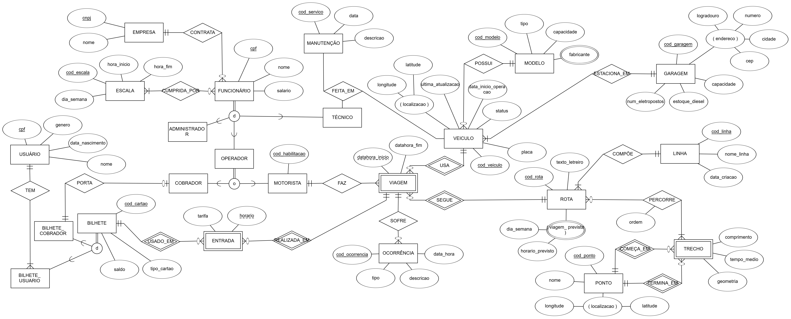

# Etapa 3 - Projeto Conceitual do Banco de Dados usando o Modelo EER

## 1. Introdução

Este documento apresenta o projeto conceitual do banco de dados para o sistema operacional e informativo de uma rede de transporte público por ônibus, usando o Modelo Entidade-Relacionamento Estendido (EER). Esta etapa servirá como base para o projeto lógico utilizando o modelo Relacional na próxima etapa.

## 2. Diagrama EER

## 3. Entidades e atributos

### 3.1 Entidade: LINHA

#### Descrição
Representa as linhas de transporte público disponíveis na rede.

#### Atributos
- **cod_linha** (Chave primária): Identificador único da linha.
- **nome_linha**: Nome ou número da linha.
- **data_criacao**: Data em que a linha começou a operar.

### 3.2 Entidade: ROTA

#### Descrição
Representa o trajeto específico dentro de uma linha, que pode incluir pontos, trechos e um itinerário definido.

#### Atributos
- **cod_rota** (Chave primária): Identificador único da rota.
- **texto_letreiro**: Texto exibido no letreiro, indicando o destino ou nome da rota.
- **viagem_prevista**: Atributo multivalorado composto que representa o quadro de horários da rota, contendo:
  - **dia_semana**: O dia da semana da viagem prevista (ex.: Segunda, Terça ou codificação 0–6).
  - **horario_previsto**: O horário da partida prevista.

### 3.3 Entidade: TRECHO

#### Descrição
Define um segmento específico de rota entre dois ou mais pontos. É uma entidade fraca vinculada a um par de PONTO.

#### Atributos
- **cod_ponto_1** (Chave primária composta e estrangeira): Identificador do primeiro ponto do trecho.
- **cod_ponto_2** (Chave primária composta e estrangeira): Identificador do segundo e último ponto do trecho
- **comprimento**: Extensão do trecho (em metros).
- **tempo_medio**: Tempo médio de percurso.
- **geometria**: Objeto da geometria de linha do trecho.

### 3.4 Entidade: PONTO

#### Descrição
Representa locais de parada ou referência em uma rota, como pontos de ônibus ou cruzamentos.

#### Atributos
- **cod_ponto** (Chave primária): Identificador único do ponto.
- **nome**: Nome descritivo do ponto (ex.: “Terminal Central”).
- **latitude**: Latitude do ponto.
- **longitude**: Longitude do ponto.

### 3.5 Entidade: VIAGEM

#### Descrição
Registra a realização efetiva de uma rota em um horário específico, associada a um motorista e a um veículo. É uma entidade fraca vinculada a VEÍCULO e ROTA.

#### Atributos
- **datahora_inicio**: Momento registrado de início da viagem.
- **datahora_fim**: Momento registrado de término da viagem.

### 3.6 Entidade: OCORRÊNCIA

#### Descrição
Registra incidentes ou eventos que ocorreram durante uma viagem (como atrasos, acidentes, problemas mecânicos etc.).

#### Atributos
- **cod_ocorrencia** (Chave primária): Identificador único da ocorrência.
- **data_hora**: Data e hora do registro do evento.
- **descricao**: Detalhes sobre a ocorrência.
- **tipo**: Classificação da ocorrência (ex.: “pane mecânica”, “acidente”, etc.).

### 3.7 Entidade: USUÁRIO

#### Descrição
Representa o passageiro ou cliente que utiliza o sistema de bilhetagem por cartão de transporte.

#### Atributos
- **cpf** (Chave primária): CPF do usuário (identificador único).
- **nome**: Nome completo do usuário.
- **data_nascimento**: Data de nascimento do usuário.
- **genero**: Informação de gênero (opcional).

### 3.8 Entidade: BILHETE

#### Descrição
Representa o cartão ou passe utilizado pelo usuário para pagar a tarifa de transporte.

#### Atributos
- **cod_cartao** (Chave primária): Identificador único do bilhete/cartão.
- **saldo**: Saldo monetário atual disponível no cartão.
- **tipo_cartao**: Tipo do bilhete (ex.: Estudante, Comum, Idoso, Cobrador, etc.).

### 3.9 Entidade: ENTRADA

#### Descrição
Registra o ato de pagamento da passagem em uma viagem, incluindo valor da tarifa cobrada e horário.É uma entidade fraca de BILHETE e VIAGEM que, por sua vez, é entidade fraca de VEÍCULO e ROTA a partir de relacionamentos de identificação.

#### Atributos
- **tarifa**: Valor cobrado no momento da entrada.
- **horario** (identificador parcial): Momento em que o usuário passou pela catraca ou registrou a entrada.

### 3.10 Entidade: FUNCIONÁRIO

#### Descrição
Representa o colaborador vinculado à empresa de transporte. Tem dois tipos disjuntos: OPERADOR, TÉCNICO e ADMINISTRADOR.

#### Atributos
- **cpf** (Chave primária): CPF do funcionário.
- **nome**: Nome completo do funcionário.
- **salario**: Valor de salário do funcionário.

### 3.11 Entidade: TÉCNICO

#### Descrição
Subtipo de Funcionário incumbido das atividades de manutenção de veículos.

#### Atributos
- *Herdados de FUNCIONÁRIO*: cpf, nome, salario.
- *Não possui atributos próprios além dos herdados*.

### 3.12 Entidade: ADMINISTRADOR

#### Descrição
Subtipo de Funcionário incumbido das atividades de administração do sistema.

#### Atributos
- *Herdados de FUNCIONÁRIO*: cpf, nome, salario.
- *Não possui atributos próprios além dos herdados*.

### 3.13 Entidade: OPERADOR

#### Descrição
Subtipo de Funcionário que atua diretamente na operação do sistema. Tem dois tipos conjuntos: MOTORISTA e COBRADOR.

#### Atributos
- *Herdados de FUNCIONÁRIO*: cpf, nome, salario.
- *Não possui atributos próprios além dos herdados*.

### 3.14 Entidade: COBRADOR

#### Descrição
Subtipo de Operador responsável por receber pagamento de passagens ou validar bilhetes.

#### Atributos
- *Herdados de OPERADOR*: cpf, nome, salario.
- *Não possui atributos próprios além dos herdados* (conforme o diagrama atual).

### 3.15 Entidade: MOTORISTA

#### Descrição
Subtipo de Operador responsável por conduzir o veículo no percurso definido.

#### Atributos
- *Herdados de OPERADOR*: cpf, nome, salario.
- **cod_habilitacao** (ou num_cnh): Número de registro da habilitação.

### 3.16 Entidade: ESCALA

#### Descrição
Define o horário de trabalho de um funcionário, incluindo hora de início e hora de término.

#### Atributos
- **cod_escala** (Chave primária): Identificador único da escala.
- **dia_semana**: Dia da semana da escala.
- **hora_inicio**: Horário em que a escala começa.
- **hora_fim**: Horário em que a escala termina.

### 3.17 Entidade: EMPRESA

#### Descrição
Representa as empresas que gerenciam e contratam os funcionários para o sistema de transporte.

#### Atributos
- **cnpj** (Chave primária): Identificador único da empresa.
- **nome**: Nome legal da empresa.

### 3.18 Entidade: MANUTENÇÃO

#### Descrição
Registra um serviço de reparo ou revisão feitos nos veículos.

#### Atributos
- **cod_servico** (Chave primária): Identificador único da manutenção/serviço.
- **data**: Data em que a manutenção ocorreu.
- **descricao**: Detalhes sobre o tipo de manutenção realizada.

### 3.19 Entidade: VEÍCULO

#### Descrição
Representa o veículo utilizado para prestar serviço de transporte, como ônibus ou vans.

#### Atributos
- **cod_veiculo** (Chave primária): Identificador único do veículo.
- **placa**: Placa de identificação.
- **data_inicio_operacao**: Data em que o veículo começou a operar.
- **status**: situação do veículo (se está ativo, em manutenção...).
- **latitude** (opcional): Localização atual do veículo.
- **longitude** (opcional): Localização atual do veículo.
- **ultima_atualização**: data e hora da última atualização da localização (latitude e longitude)

### 3.20 Entidade: MODELO

#### Descrição
Representa o modelo do veículo, incluindo informações de capacidade e fabricante.

#### Atributos
- **cod_modelo** (Identificador): Nome do modelo.
- **tipo**: Tipo do veículo (ex.: ônibus urbano, micro-ônibus, elétrico, etc.).
- **fabricante**: Fabricante do modelo de veículo. É multivalorado pois um mesmo modelo pode ser fabricado por mais de uma empresa.
- **capacidade**: Capacidade de transporte (número de passageiros).

### 3.21 Entidade: GARAGEM

#### Descrição
Local onde os veículos são estacionados, reabastecidos e mantidos.

#### Atributos
- **cod_garagem** (Chave primária): Identificador único da garagem.
- **estoque_diesel**: Quantidade de diesel disponível (quando aplicável).
- **num_eletropostos**: Quantidade de pontos de recarga elétrica.
- **capacidade**: Capacidade máxima de veículos.
- **endereço**: Atributo composto por:
  - **logradouro**: Nome da rua ou avenida.
  - **numero**: Número do endereço.
  - **cidade**: Município onde a garagem se localiza.
  - **cep**: Código de Endereçamento Postal da localização.

## 4. Relacionamentos

### 4.1 Relacionamento: CONTRATA (entre EMPRESA e FUNCIONÁRIO)
- **Cardinalidade**: 1:N  
  - Uma EMPRESA contrata vários FUNCIONÁRIOS (1 para EMPRESA, N para FUNCIONÁRIO).  
  - Cada FUNCIONÁRIO é contratado por apenas uma EMPRESA.
- **Atributos**: Não possui

### 4.2 Relacionamento: CUMPRIDA_POR (entre ESCALA e FUNCIONÁRIO)
- **Cardinalidade**: M:N <!-- discutir -->  
  - Uma ESCALA pode ser cumprida por vários FUNCIONÁRIOS, e um FUNCIONÁRIO pode cumprir diversas escalas (dependendo da modelagem exata).
- **Atributos**: Não possui

### 4.3 Relacionamento: FEITA_EM (entre TÉCNICO, MANUTENÇÃO e VEÍCULO)
- **Cardinalidade**: indefinida, relacionamento ternário
- **Atributos**: Não possui

### 4.4 Relacionamento: POSSUI (entre VEÍCULO e MODELO)
- **Cardinalidade**: N:1  
  - Vários VEÍCULOS podem ter o mesmo MODELO.  
  - Cada VEÍCULO possui exatamente um MODELO.
- **Atributos**: Não possui

### 4.5 Relacionamento: ESTACIONA_EM (entre VEÍCULO e GARAGEM)
- **Cardinalidade**: N:1  
  - Vários VEÍCULOS podem estar estacionados em uma GARAGEM.  
  - Cada VEÍCULO se estaciona em uma única GARAGEM.
- **Atributos**: Não possui

### 4.6 Relacionamento: SEGUE (entre VIAGEM e ROTA)
- **Cardinalidade**: N:1
  - Uma VIAGEM corresponde a exatamente uma ROTA.  
  - Uma ROTA costuma ter múltiplas viagens. 
- **Atributos**: Não possui

### 4.7 Relacionamento: USA (entre VIAGEM e VEÍCULO)
- **Cardinalidade**: N:1
  - Uma VIAGEM usa exatamente um VEÍCULO.  
  - Um VEÍCULO é usado em várias VIAGENS. 
- **Atributos**: Não possui

### 4.8 Relacionamento: COMPÕE (entre LINHA e ROTA)
- **Cardinalidade**: 1:N <!-- discutir -->  
  - Uma LINHA pode ter múltiplas ROTAS.  
  - Cada ROTA pertence a exatamente uma LINHA.
- **Atributos**: Não possui

### 4.9 Relacionamento: PERCORRE (entre ROTA e TRECHO)
- **Cardinalidade**: M:N
  - Uma ROTA pode ser formada por vários TRECHOS.  
  - Um TRECHO pode ser compartilhado entre rotas distintas.  
- **Atributos**:
  - ordem: Denota a ordem do TRECHO no percurso da ROTA
  - 

### 4.10 Relacionamento: PERTENCE_A (entre PARTIDA_PREVISTA e ROTA)
- **Cardinalidade**: N:1  <!-- discutir -->  
  - Diversas PARTIDAS_PREVISTAS podem pertencer a uma mesma ROTA (ou linha/itinerário específico).  
  - Cada PARTIDA_PREVISTA refere-se a apenas uma ROTA.
- **Atributos**: Não possui

### 4.11 Relacionamento: FAZ (entre MOTORISTA e VIAGEM)
- **Cardinalidade**: 1:N  
  - Um MOTORISTA pode fazer várias VIAGENS (em momentos ou dias distintos).  
  - Cada VIAGEM é feita por exatamente um MOTORISTA.
- **Atributos**: Não possui

### 4.12 Relacionamento: SOFRE (entre VIAGEM e OCORRÊNCIA)
- **Cardinalidade**: 1:N  
  - Uma VIAGEM pode ter várias OCORRÊNCIAS (incidentes, eventos).  
  - Cada OCORRÊNCIA está associada a uma única VIAGEM.
- **Atributos**: Não possui

### 4.13 Relacionamento: TEM (entre USUÁRIO e BILHETE) <!-- discutir Sobre cobrador (pq motorista ou tecnico tbm n poderiam ter bilhete?  -Podem, mas aí teriam como usuários, acho) -->  
- **Cardinalidade**: 1:N  
  - Um USUÁRIO pode ter vários BILHETES (cartões).  <!-- discutir -->  
  - Cada BILHETE pertence a um único USUÁRIO.
- **Atributos**: Não possui

### 4.14 Relacionamento: COBRADOR_TEM (entre COBRADOR e BILHETE)
- **Cardinalidade**: 1:1  
  - Um COBRADOR tem exatamente um bilhete.  
  - Um BILHETE que participa desta relação pertence a exatamente 1 COBRADOR. <!-- discutir -->
- **Atributos**: Não possui

### 4.15 Relacionamento: USADO_EM (entre BILHETE e ENTRADA)
- **Cardinalidade**: 1:N  
  - Um BILHETE pode ser utilizado muitas vezes, gerando várias ENTRADAS (passagens).  
  - Cada ENTRADA (momento de passagem) está vinculada a exatamente um BILHETE.
- **Atributos**: Não possui

### 4.16 Relacionamento: COMEÇA_EM (entre TRECHO e PONTO)
- **Cardinalidade**: N:1  
  - Um TRECHO tem exatamente um PONTO de início.  
  - um PONTO pode ser parte de vários trechos.
- **Atributos**: Não possui

### 4.17 Relacionamento: TERMINA_EM (entre TRECHO e PONTO)
- **Cardinalidade**: N:1  
  - Um TRECHO tem exatamente um PONTO de término.  
  - um PONTO pode ser parte de vários trechos.
- **Atributos**: Não possui

## 5. Especializações e Generalizações

### 5.1 Generalização: FUNCIONÁRIO (Superclasse)
- **Especializações**:  
  - **TÉCNICO** (Disjoint): Responsável por realizar manutenções  
    - **Atributos adicionais**: Não possui (herda os de FUNCIONÁRIO)  
  - **OPERADOR** (Disjoint): Atua na operação de veículos e cobranças  
    - **Atributos adicionais**: Não possui (herda os de FUNCIONÁRIO)

### 5.2 Generalização: OPERADOR (Superclasse)
- **Especializações**:  
  - **COBRADOR** (Overlap, se puder ser também motorista, ou Disjoint, se não puder): Atua na cobrança de passagens  
    - **Atributos adicionais**: Não possui (herda os de OPERADOR)  
  - **MOTORISTA** (Overlap ou Disjoint, dependendo do modelo de operação da rede): Conduz veículos de transporte  
    - **Atributos adicionais**:  
      - **cod_habilitacao**: Código/registro da habilitação (CNH)

## 6. Restrições Adicionais (não representáveis no diagrama EER)

1. Um ponto terminal deve ter pelo menos 2 rotas associadas (ida e volta da mesma linha).
2. O tempo médio de percurso de uma linha deve ser coerente com a soma dos tempos médios de seus trechos.
3. Bilhetes de integração têm um limite máximo de tempo entre a primeira e a última utilização.
4. Operadores não podem ser escalados para viagens consecutivas sem um intervalo mínimo de descanso.
5. Manutenções preventivas devem ser programadas com base na quilometragem ou no tempo desde a última manutenção.
6. As coordenadas geográficas de estações devem estar dentro dos limites da área de cobertura do sistema.
7. O número total de veículos ativos deve ser suficiente para atender à frequência definida para todas as linhas ativas.
