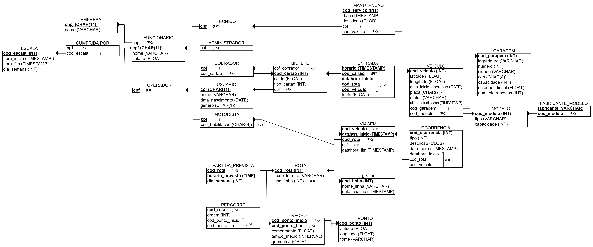

# Etapa 4 – Projeto Lógico do Banco de Dados (Modelo Relacional)

Este documento foi **re‑gerado** a partir do diagrama abaixo (``esquema_relacional_projeto1.png``) e descreve:

1. O **esquema relacional completo** – tabelas, atributos, tipos, chaves, restrições.  
2. A **análise de normalização** (1FN → BCNF).  
3. Recomendações de **índices, gatilhos e visões** para uso prático.



---

## 1. Convenções

| Símbolo | Significado |
|---------|-------------|
| **(PK)** | chave primária |
| **(FK)** | chave estrangeira (tipo omitido – usa o da referência) |
| **(U)**  | restrição de unicidade |
| `CHECK` | restrição de domínio |
| `DEFAULT` | valor padrão |

---

## 2. Esquema Relacional

> Cada bloco SQL já reflete fielmente os nomes/relacionamentos do diagrama.

### 2.1 EMPRESA
```sql
EMPRESA (
    cnpj   CHAR(14)  PRIMARY KEY,
    nome   VARCHAR(120)
);
```

### 2.2 FUNCIONARIO (e subclasses)
```sql
FUNCIONARIO (
    cpf    CHAR(11)  PRIMARY KEY,
    cnpj   (FK),                -- → EMPRESA
    nome   VARCHAR(120),
    salario DECIMAL(10,2)
);

TECNICO       (cpf (FK,PK));
ADMINISTRADOR (cpf (FK,PK));
OPERADOR      (cpf (FK,PK));

MOTORISTA (
    cpf             (FK,PK),
    cod_habilitacao CHAR(9) (NOT NULL, U)
);

COBRADOR (cpf (FK,PK));
```

### 2.3 ESCALA e CUMPRIDA_POR
```sql
ESCALA (
    cod_escala  INT PRIMARY KEY,
    hora_inicio TIMESTAMP,
    hora_fim    TIMESTAMP,
    dia_semana  INT CHECK (dia_semana BETWEEN 0 AND 6)
);

CUMPRIDA_POR (
    cpf        (FK),
    cod_escala (FK),
    PRIMARY KEY (cpf, cod_escala)
);
```

### 2.4 USUARIO e BILHETE
```sql
USUARIO (
    cpf             CHAR(11) PRIMARY KEY,
    nome            VARCHAR(120),
    data_nascimento DATE,
    genero          CHAR(1) CHECK (genero IN ('M','F','O'))
);

BILHETE (
    cod_cartao   INT PRIMARY KEY,
    saldo        DECIMAL(10,2),
    tipo_cartao  INT,
    cpf          (FK),           -- → USUARIO
    cpf_cobrador (FK) (U)        -- → COBRADOR
);
```

### 2.5 LINHA • ROTA • PARTIDA_PREVISTA
```sql
LINHA (
    cod_linha   INT PRIMARY KEY,
    nome_linha  VARCHAR(50),
    data_criacao TIMESTAMP DEFAULT NOW()
);

ROTA (
    cod_rota       INT PRIMARY KEY,
    texto_letreiro VARCHAR(120),
    cod_linha      (FK)
);

PARTIDA_PREVISTA (
    cod_rota         (FK),
    horario_previsto TIME,
    dia_semana       INT CHECK (dia_semana BETWEEN 0 AND 6),
    PRIMARY KEY (cod_rota, dia_semana, horario_previsto)
);
```

### 2.6 Rede de Pontos e Trechos
```sql
PONTO (
    cod_ponto  INT PRIMARY KEY,
    latitude   FLOAT,
    longitude  FLOAT,
    nome       VARCHAR(120)
);

TRECHO (
    cod_ponto_inicio (FK),   -- → PONTO
    cod_ponto_fim    (FK),
    comprimento      FLOAT,
    tempo_medio      INTERVAL,
    geometria        OBJECT,
    PRIMARY KEY (cod_ponto_inicio, cod_ponto_fim)
);

PERCORRE (                           -- rota × trecho
    cod_rota         (FK),
    ordem            INT,
    cod_ponto_inicio (FK),
    cod_ponto_fim    (FK),
    PRIMARY KEY (cod_rota, ordem),
    FOREIGN KEY (cod_ponto_inicio, cod_ponto_fim)
        REFERENCES TRECHO(cod_ponto_inicio, cod_ponto_fim)
);
```

### 2.7 Frota, Modelos e Garagens
```sql
FABRICANTE (
    fabricante VARCHAR(60) PRIMARY KEY
);

MODELO (
    cod_modelo INT PRIMARY KEY,
    tipo       VARCHAR(30),
    capacidade INT,
    fabricante (FK)
);

GARAGEM (
    cod_garagem   INT PRIMARY KEY,
    logradouro    VARCHAR(120),
    numero        INT,
    cidade        VARCHAR(80),
    cep           CHAR(8),
    capacidade    INT,
    estoque_diesel FLOAT,
    num_eletropostos INT
);

VEICULO (
    cod_veiculo        INT PRIMARY KEY,
    latitude           FLOAT,
    longitude          FLOAT,
    data_inicio_operacao DATE,
    placa              CHAR(7) (U),
    status             INT,
    ultima_atualizacao TIMESTAMP,
    cod_garagem        (FK),
    cod_modelo         (FK)
);
```

### 2.8 Operações
```sql
MANUTENCAO (
    cod_servico INT PRIMARY KEY,
    data        TIMESTAMP,
    descricao   CLOB,
    cpf         (FK),        -- técnico
    cod_veiculo (FK)
);

VIAGEM (
    cod_veiculo     (FK),
    datahora_inicio TIMESTAMP,
    cod_rota        (FK),
    cpf             (FK),    -- motorista
    datahora_fim    TIMESTAMP,
    PRIMARY KEY (cod_veiculo, datahora_inicio)
);

OCORRENCIA (
    cod_ocorrencia  INT PRIMARY KEY,
    tipo            INT,
    descricao       CLOB,
    data_hora       TIMESTAMP,
    datahora_inicio TIMESTAMP,
    cod_rota        (FK),
    cod_veiculo     (FK)
);

ENTRADA (
    horario         TIMESTAMP PRIMARY KEY,
    cod_cartao      (FK),
    tarifa          DECIMAL(6,2),
    datahora_inicio TIMESTAMP,
    cod_rota        (FK),
    cod_veiculo     (FK)
);
```

---

## 3. Normalização (até BCNF)

- **1FN** – todos os atributos são atômicos e não repetitivos.  
- **2FN** – nenhuma coluna não‑chave depende somente de parte de uma PK composta.  
- **3FN** – nenhum atributo não‑chave depende de outro não‑chave.  
- **BCNF** – depois de separar `FABRICANTE` de `MODELO`, todo determinante é chave candidata.

| Tabela | Forma normal | Observação principal |
|--------|--------------|----------------------|
| ENTIDADES com PK simples | BCNF | somente dependências triviais |
| ASSOCIAÇÕES (PK composta) | BCNF | não há atributos extras fora da PK |
| MODELO | BCNF | `cod_modelo` → resto |
| FABRICANTE | BCNF | atributo único |

---

## 4. Índices Recomendados

1. Índice em **todas as FKs** ↔ velocidade de junções.  
2. `VEICULO(placa)` (já UNIQUE).  
3. `BILHETE(cpf)` e `ENTRADA(horario)`.  
4. Índices espaciais em `PONTO(latitude, longitude)` se o SGBD suportar GIS.  
5. `(cod_veiculo, datahora_inicio)` já é PK de **VIAGEM**, serve como índice primário.

---

## 6. Visões Úteis

1. **View_ViagemCompleta** – une viagem + rota + linha + motorista + veículo.  
2. **View_ManutencaoHistorico** – histórico por veículo.  
3. **View_OcorrenciasDia** – todas as ocorrências dentro de um intervalo.

---

## 7. Conclusão

O esquema logicamente derivado do diagrama está **inteiramente em BCNF**, reduzindo redundâncias e anomalias e pronto para implementação em PostgreSQL, MySQL ou Oracle.

